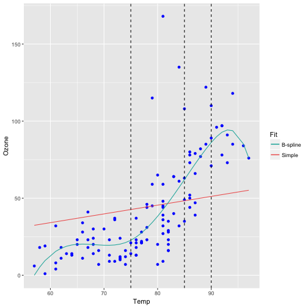

Simple Linear vs Spline Regression
========================================================
author: Dwayne Dreakford
date: June 2, 2017
autosize: true

Introduction
========================================================

### Objectives

- Provide an example of applying **spline regression** to model the relationship between two variables where we (at least I :-)) do not fully understand the theoretical basis of the relationship (temperature and ozone levels)
- Compare the effectiveness of simple linear and spline linear models for this purpose

To use the app
========================================================

1. **Go to:** [Simple Linear vs Spline Regression](https://dwaynedreakford.shinyapps.io/simple_linear_vs_spline_regression/)
2. **Select knot points** from the list of Temp values
3. Click **Generate Plot**

***




Ingredients
========================================================

- **Shiny App:** [Simple Linear vs Spline Regression](https://dwaynedreakford.shinyapps.io/simple_linear_vs_spline_regression/), hosted on [shinyapps.io](https://www.shinyapps.io/)
    + Full source on github: [dwaynedreakford/SplineRegression](https://github.com/dwaynedreakford/SplineRegression)
- **Data:** `airquality`, from the [datasets package](https://stat.ethz.ch/R-manual/R-devel/library/datasets/html/00Index.html)
- **Supporting packages:** [splines2](https://cran.r-project.org/web/packages/splines2/index.html), [dplyr](https://cran.rstudio.com/web/packages/dplyr/vignettes/introduction.html), [ggplot](http://ggplot2.org/)

Key Code
========================================================
See the [interactive app](https://dwaynedreakford.shinyapps.io/simple_linear_vs_spline_regression/) for the plots


```r
# Simple linear model
slm <- lm(Ozone ~ Temp - 1, airquality)
airquality$Ozone.fitlm <- slm$fitted.values

# B-splines (piecewise additive linear model, where the rate of
# increase in ozone can vary over the range of our observations).
library(splines2)
knotsTemp <- c(75,85, 90)
bsMat <- bSpline(airquality$Temp, knots=knotsTemp)
bslm <- lm(airquality$Ozone ~ bsMat - 1)
airquality$Ozone.fitbslm <- bslm$fitted.values
```

